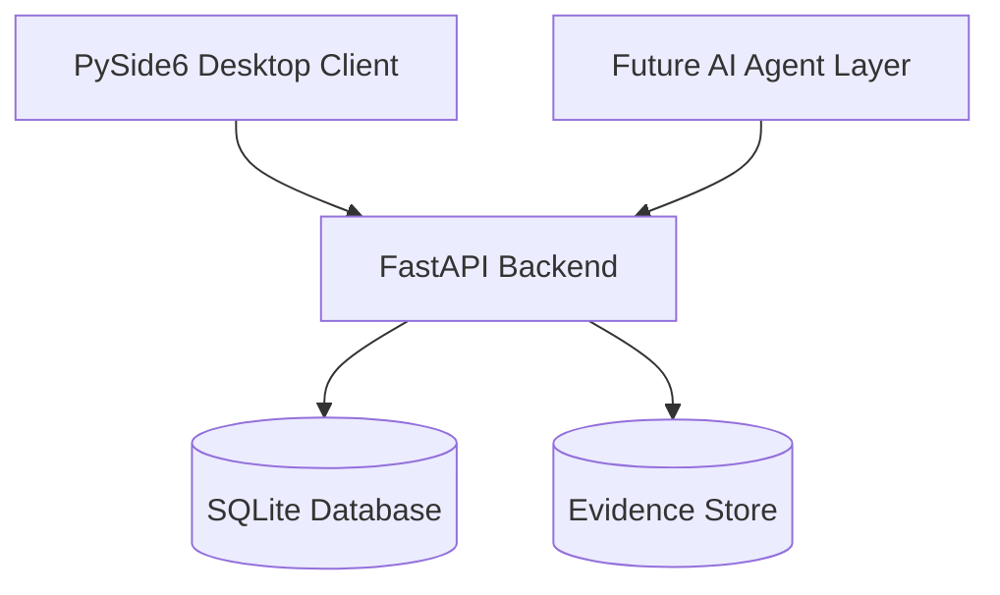

# CaseMind Defense Architecture

## 1. Overview

CaseMind Defense is a local-first Evidence Management and Investigation Intelligence platform.

The system is designed around three independent layers:

## 2. Backend (`backend/`)

FastAPI + SQLModel + SQLite. Runs locally on `127.0.0.1:8000`.

| Layer | Path | Responsibility |
|-------|------|----------------|
| API routers | `app/api/` | Thin HTTP endpoints: evidence, search, ai, timeline, entities, contradictions, audit, health |
| Services | `app/services/` | Business logic: import pipeline, text extraction + OCR, chunking, embeddings, semantic search, entity/timeline extraction, audit logging |
| Models | `app/models/` | SQLModel tables: `Evidence`, `EvidenceChunk`, `AuditEvent` |
| Core | `app/core/` | Settings (env-driven, read at instantiation) |
| DB | `app/db.py` | Engine cache, session dependency, naive column migration |

### Evidence import pipeline

1. SHA256 hash → duplicate detection (409 on duplicate)
2. Copy to content-addressed evidence store (`data/evidence_store/<sha256><ext>`)
3. Text extraction: native text layer (TXT/PDF) → OCR fallback for scanned PDFs and images (Tesseract, `eng+heb`, capped at `CASEMIND_PDF_OCR_MAX_PAGES`)
4. Chunking with exact `chars:start-end` citation offsets
5. Embeddings per chunk (SentenceTransformers, hash-based fallback) with model/dimension/version metadata
6. Status: `indexed` / `ocr_indexed` / `extraction_not_supported` / `no_text_found` / `text_extraction_failed`
7. Every step logged to the audit trail

## 3. Desktop (`desktop/`)

PySide6 client. Talks to the backend over HTTP (`requests`).

- `api/` — HTTP client + endpoint constants
- `config/` — backend URL, timeouts (env-overridable)
- `controllers/` — mediation between UI and API
- `workers/` — QRunnable-based background API workers
- `ui/pages/` — Dashboard, Evidence, Search, AI pages
- `ui/widgets/` — reusable widgets (sprint 0.12.1: table / preview / inspector / toolbar)

## 4. Key decisions

- **Local-first**: no cloud dependency; all data stays on the user's machine
- **Evidence-grounded AI**: answers must cite `chars:start-end` locations in stored chunks
- **SQLite** as the single store until scale demands more (FTS5 + sqlite-vec planned)
- **pypdfium2** for PDF rendering (BSD license — commercial-safe, unlike AGPL alternatives)
- **Chain of custody**: content-addressed storage + SHA256 + append-only audit events
